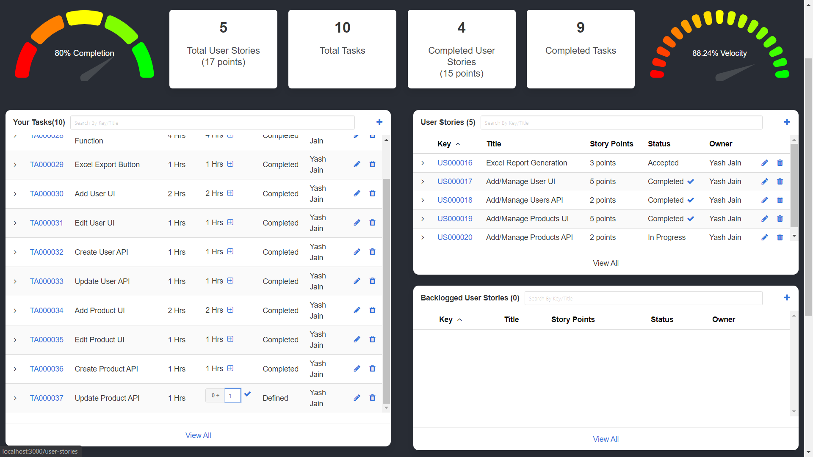
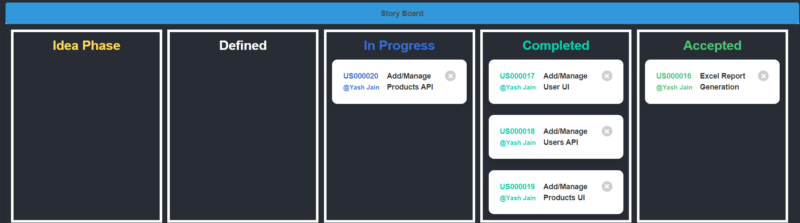
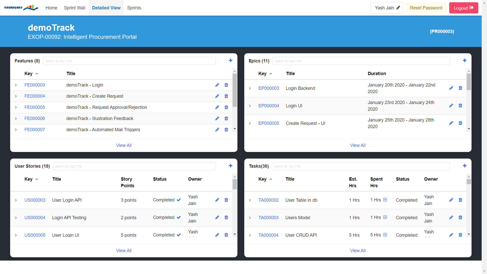
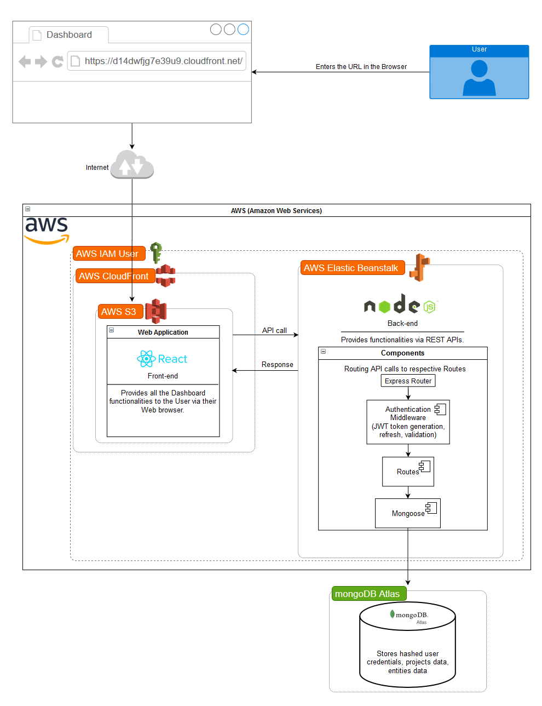

# Dashboard

https://d14dwfjg7e39u9.cloudfront.net

## Problem Statement: 
For most of the Software Development teams monitoring and tracking of the project progress is a major part of managing the project efficiently. It is vital for the Software Product Manager and Owner to manage the project by overseeing the status and progress of the development

There is!!

## Dashboard
Agile Dashboard is a Project Management Tool for managing multiple scrum-based projects. It provides the real time progress for the projects, allows managers to monitor and track team efficiency, visually oversee team and project status. Allows team to view the project progress in a graphically appealing format that is well perceived by anyone and can help them enact rather than wasting time on regular tracking hence assisting their workflow

### Dashboard offers:
	- Allow Team members to create features, epics, user stories and tasks for their projects
	- Manage the various entities via user friendly UI
	- Track the project status and progress by visual graphs and other self-understandable components.
	- Allow Managers to monitor the team progress and manage various teams.
	- Allow Product Owners to see the progress and status of the project.
	- Allow Admin to manage all projects, users, roles, and teams

## Sprint Board

## Story Board

## Detailed View

## Technology Stack Used:
    - React (v16.13.1)
	- Node.js (v12.16.3)
	- MongoDB Atlas
	- Amazon Web Services

## Coding Standards: 
    - Modularity
    - Descriptive name conventions (full words – camel casing)
    - Component/Class names represents its purpose
	- Encapsulation
    - Proper Indentation
    - Proper response status codes (e.g. 201, 401…)
	- Server-Side Validations (e.g. Email format, password requirements...)
    - Error/Exception Handling (e.g. Null Pointer exception on User Not found)
    - Custom Error Message (e.g. User Already Exists, Invalid Credentials…)
	- Client-Side Validations (e.g. Mandatory Requirements, email format…)
    - Responsive Application
    - Display of Validation errors

## Security Features: 
	- Password Hashing for storage in database using (Bcrypt-HashSalt) – (Server Side)
	- JWT Token Authentication
    - Authentication Middleware
    - JWT Token Validation
    - Error Interception

## API Documentation:
 - https://app.swaggerhub.com/apis-docs/YashJainHSR/Dashboard/1.0.0
